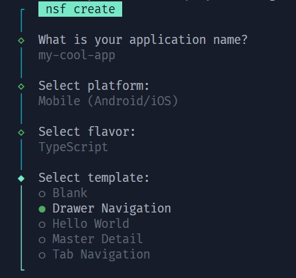

# NativeScript Forge CLI (nsf)

[](https://www.npmjs.com/package/@nativescript-forge/cli)
[](https://www.npmjs.com/package/@nativescript-forge/cli)

An opinionated interactive wrapper around the NativeScript CLI, designed to streamline your development workflow with a beautiful and intuitive interface.


## Overview

NativeScript Forge CLI (`nsf`) is built on top of the standard NativeScript CLI to provide a more guided and interactive experience for common tasks, starting with project creation.

## Demo



## Installation

```bash
npm install -g nativescript-forge/cli
```

## Usage

### Create a New Project

The core feature of `nsf` is the interactive creation process:

```bash
nsf create
```

Simply follow the prompts to:

1. Enter your **Application Name**.
2. Select your **Platform** (Mobile or VisionOS).
3. Select your **Flavor** (JavaScript, TypeScript, Angular, React, Solid, Svelte, Vue).
4. Select a **Template** tailored for your chosen flavor and platform.

---

<div align="center">
  
  <p><i>Built with ❤️ for the NativeScript Community</i></p>
</div>
